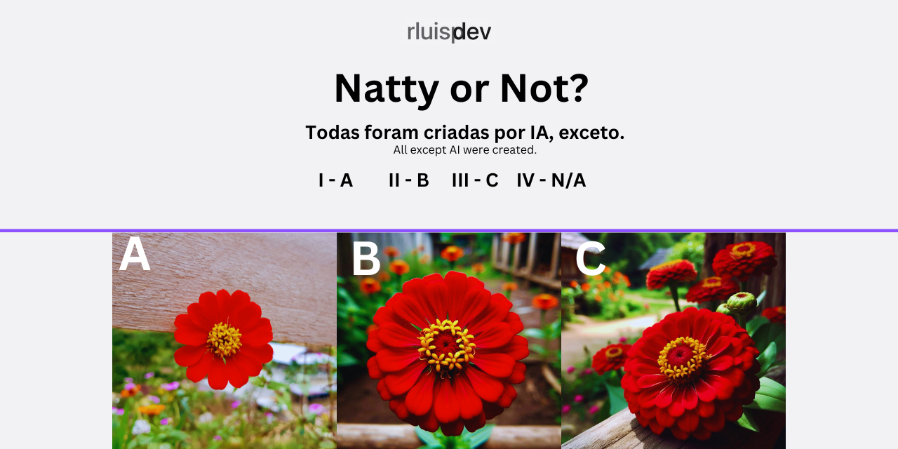

# Natural ou Fake Natty? Como Vencer na Era das IAs Generativas

### Projeto

```markdown
# "Imagem Verdadeira ou Falsa? Vamos Descobrir!" 

## 📒 Descrição
 Projeto onde há a disponilibização de 03 imagens, você identificar qual ou quais são falsas.  

## 🤖 Tecnologias Utilizadas
`DALL-E-3`
`Canvas`


## 🧐 Processo de Criação
As iamgens foram geradas pelo DALL-E-3 e adicionadas ao Canvas para elaboracao do banner para apresentação, resta a voçê se todas foram geradas no DALL-E-3 ou não...

## 🚀 Desafio


 

## Links Interessantes

[Base10: If You’re Not First, You’re Last: How AI Becomes Mission Critical](https://base10.vc/post/generative-ai-mission-critical/)


